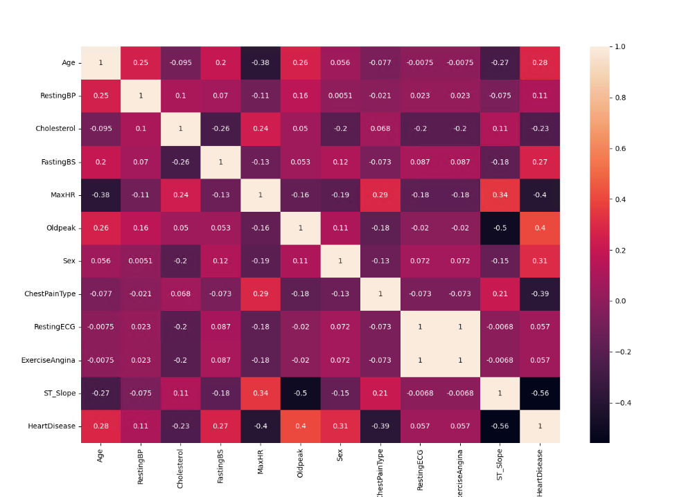
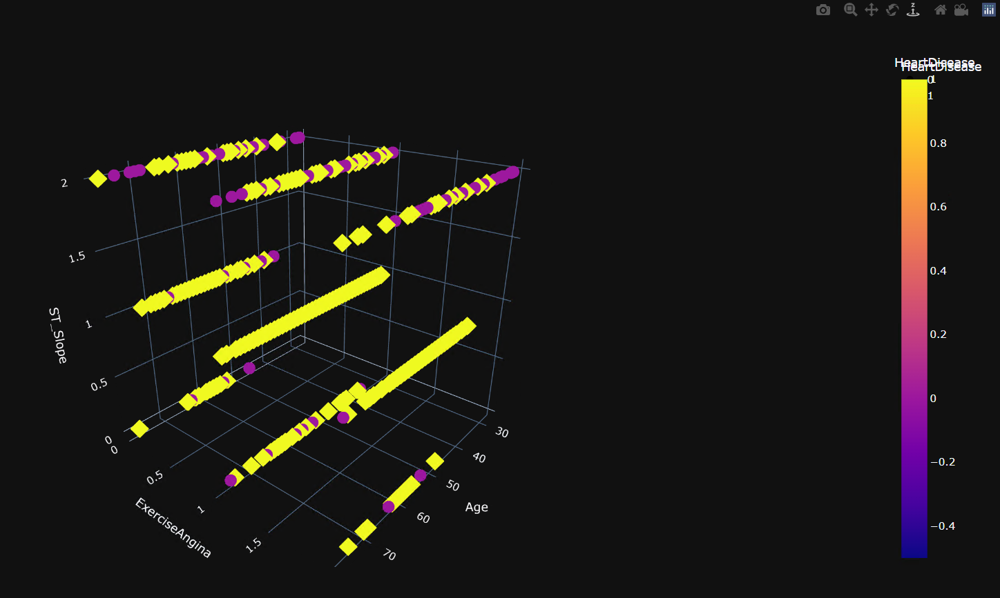
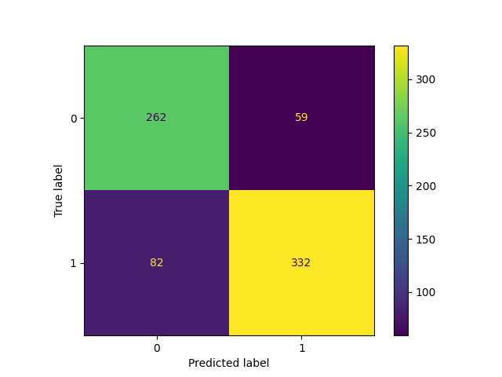
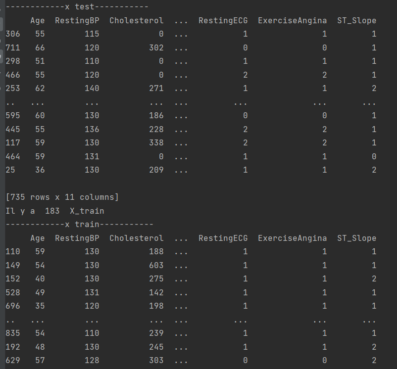
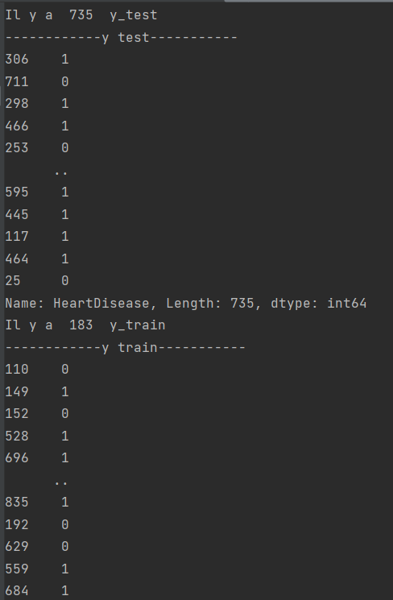
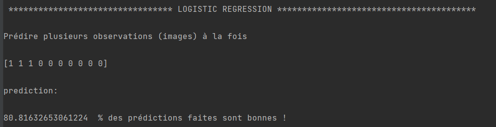
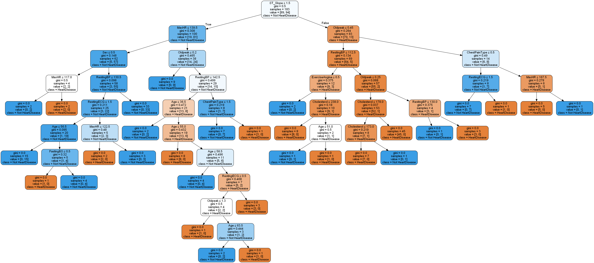
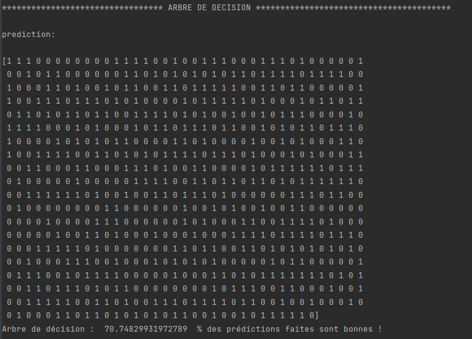

# Prédictions concernant les maladies cardiaques

## Installation du projet

1. Téléchargez le projet
2. Installez les plugins 
3. Installez chocolatey :
   - Ouvrez un PowerShell en tant qu'Administrateur et lancez cette commande "Set-ExecutionPolicy Bypass -Scope Process -Force; [System.Net.ServicePointManager]::SecurityProtocol = [System.Net.ServicePointManager]::SecurityProtocol -bor 3072; iex ((New-Object System.Net.WebClient).DownloadString('https://community.chocolatey.org/install.ps1'))"
5. Lancez la commande "choco install graphviz"  puis redémarrez votre pc 

## Etude des correlations entre plusieurs variables

Les variables : 
- Age : âge du patient [années].
- Sex : sexe du patient 
  1. M : Male 
  2. F : Female
  
- ChestPainType : type de douleur thoracique 
    1. TA : Angine typique 
    2. ATA : Angine atypique
    3. NAP : Douleur non angineuse
    4. ASY : Asymptomatique
  
- RestingBP : pression artérielle au repos [mm Hg].
- Cholestérol : cholestérol sérique [mm/dl].
- FastingBS : glycémie à jeun 
  1. 1 : si FastingBS > 120 mg/dl 
  2. 0 : sinon
- RestingECG : résultats de l'électrocardiogramme au repos 
  1. Normal : normal 
  2. ST : présentant une anomalie de l'onde ST-T (inversions de l'onde T et/ou élévation ou dépression du segment ST de > 0,05 mV) 
  3. HVG : présentant une hypertrophie ventriculaire gauche probable ou certaine selon les critères d'Estes]

- FCM : fréquence cardiaque maximale atteinte [Valeur numérique comprise entre 60 et 202].
- ExerciseAngina : angine de poitrine induite par l'exercice 
  1. Y : Oui 
  2. N : Non
  
- Oldpeak : oldpeak = ST [Valeur numérique mesurée en dépression].
- ST_Slope : la pente du segment ST du pic d'exercice 
  1. Up : en pente ascendante 
  2. Flat : plat 
  3. Down : en pente descendante
  
- HeartDisease : classe de sortie 
  1. 1 : maladie cardiaque 
  2. 0 : normal

### Représentations des corrélations des variables 

Les cartes thermiques de corrélation peuvent être utilisées pour trouver des relations linéaires et non linéaires entre les variables.

Voici celle qui nous interesse :

### Représentation en 3D  

Cette représentation en 3D permet de voir de manière plus évidante les personnes malades en fonction de trois variables.
Ainsi, dans cet exemple, nous pouvons observer que la majorité des personnes atteintes d'une maladie cardiaque sont âgées entre
40 et 70 ans, leur pente du segment ST du pic d'exercice est plate et ont une angine de poitrine induite par l'exercice.

## Analyse des prédictions

### Matrice de confusion

Le calcul de la matrice de confusion permet d'évaluer la précision d'une classification.

Celle ci-dessous indique que :
  1. 262 cas sont de vrais négatifs
  2. 82 cas sont de faux négatifs
  3. 332 cas sont de vrais positifs
  4. 59 cas sont de faux positifs

### Entrainements et tests de prédictions

Train/Test est une méthode pour mesurer la précision de votre modèle.

L' ensemble de test doit être une sélection aléatoire de 80 % des données d'origine.
L' ensemble  d'apprentissage  devrait être les 20 % restants.

###  Régression logistique

Résultat : 80% des prédictions sont bonnes.

### Arbre de decision

Résultat : 70% des prédictions sont bonnes.

